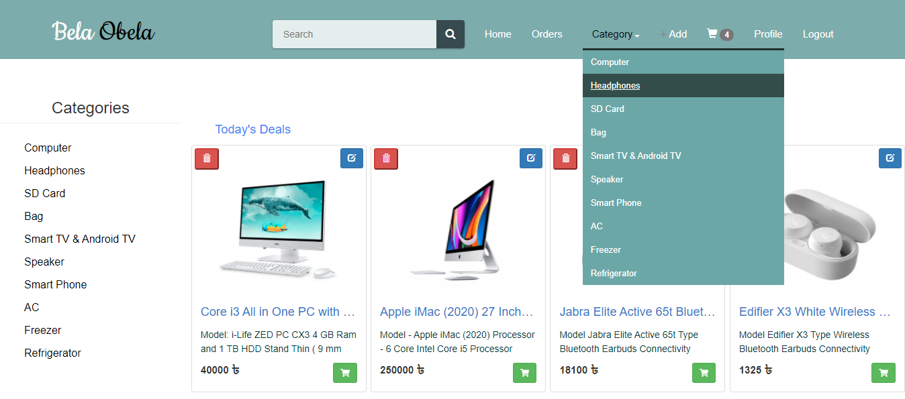
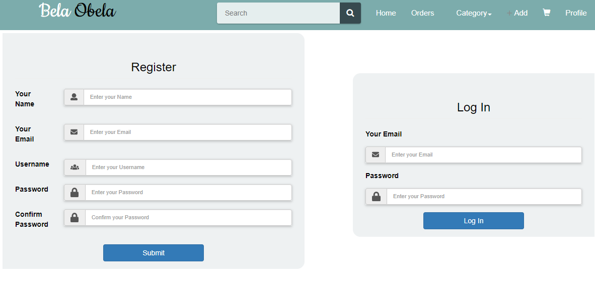
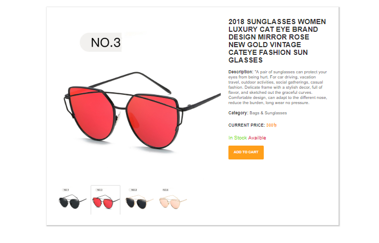
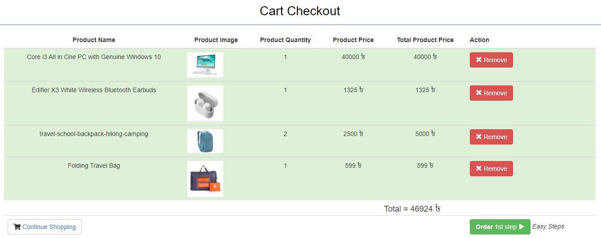
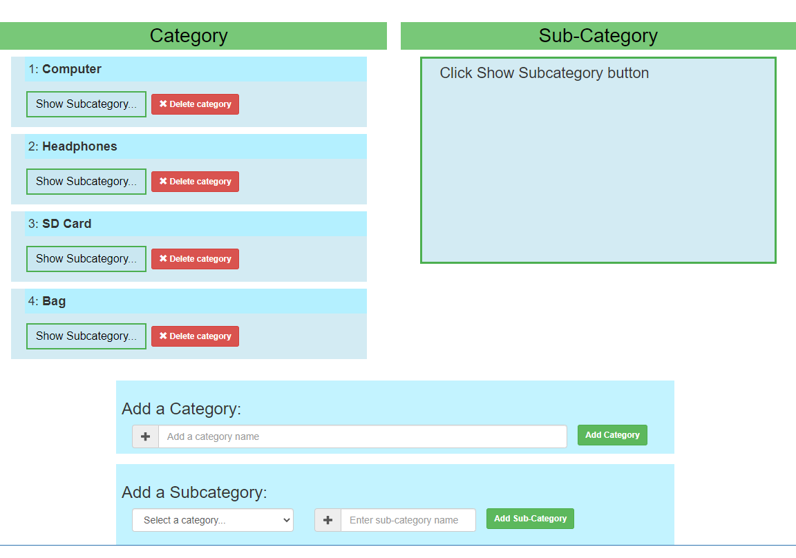
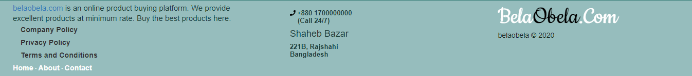

# BelaObela
Belaobela.com is an e-commerce site which is fully managed platform and developed for production. It is an online shop where customers can get their desired products within a single click. This will save shopping time of customers. Visit the web application [Live](http://belaobela.us.openode.io).

## Installation
  1. Clone this repositry : `git clone https://github.com/Aktarul/BelaObela.git`
  2. Open a terminal in this directory
  3. Install dependencies : `npm install --save`
  4. Run server : `node server.js` or `nodemon`
 
 Do not forget to run your database before running server.
  
**Open another terminal in the directory**

  5. Navigate to frontend directory : `cd frontend`
  6. Install dependencies : `npm install --save`
  7. Run client : `ng serve`
  8. Visit: `localhost:4200`

## Usage
After completing installation create at least one Admin. Here are the steps,
  1. Register an account. 
  2. Open any GUI for MongoDB ( Compass/ Robo3T )
  3. Change the created user's isAdmin property to true

Thus getting an admin gives abilities to add, update, delete products, manage users, orders and complains.

## UI-Design with Angular

#### _Homepage_

#### _Register and Login_

#### _Product Details_

#### _Shopping Cart_

#### _Category Management_

#### _Footer_

## Licence
This project is licensed under the MIT License - see the [LICENSE](LICENSE) file for details
